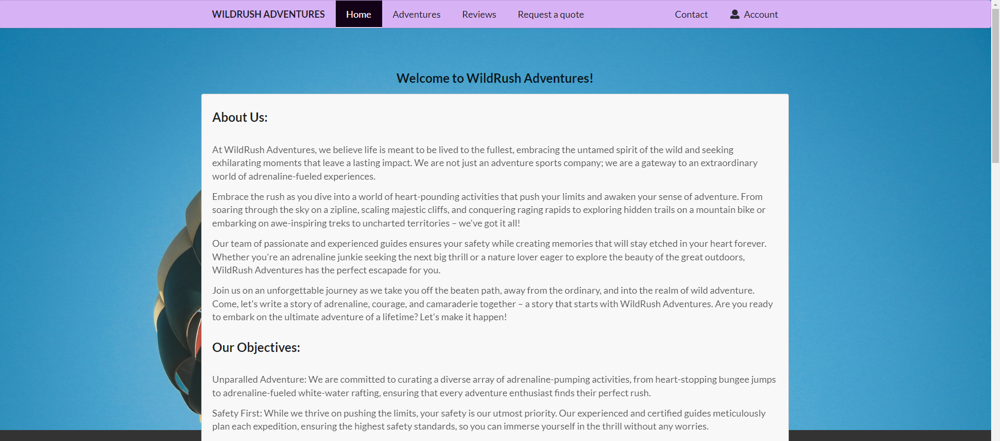

# Project Report

## **Introduction**

The purpose of this project is to create an Adventure Sports Website for "WildRush Adventures" that showcases various adventure sports activities offered by the company. The website aims to provide users with information about different adventure sports, allow them to request a personalized quote for their preferred activities, and learn more about the founding team behind the company. The project aims to attract adventure enthusiasts, promote the company's services, and facilitate easy communication with potential customers.

## Project Proposal

We want to make a website for people who love adventure sports. The website will have a lot of different activities to choose from, and it will be easy to use.

### Views

1. **Sign-up / Sign-in:** Users can create an account on the website and easily sign in to access personalized offers and experiences.
2. **Homepage:** The homepage will be a captivating introduction to our adventure sports services, showcasing our passion and expertise.
3. **Adventures:** Users can browse through various adventure activities, and by clicking on an activity, they can view details about the adventure.
4. **Request a Quote:** Users have the option to customize their adventure events according to their preferences and calculate the total price.
5. **Contact:** This page will provide users with contact information, social media links, and ways to get in touch with us.
6. **Reviews:** We will showcase user experiences and testimonials to build trust and credibility.
7. **Logout:** A straightforward option for users to log out of the website after their adventure journey.
8. ************\*\*\*\*************Profile :************\*\*\*\************* This page will provide users to edit their information including username, first name and last name.

## **Technologies**

### **Backend Technologies**

The backend of the Adventure Sports Website has been developed using Python. Python was chosen as the backend language due to its simplicity, readability, and extensive libraries and frameworks that make web development efficient and straightforward.

1. **Flask**: Flask is a lightweight and flexible Python web framework that allows for rapid development of web applications. It was chosen for its simplicity, ease of use, and ability to handle the project's requirements efficiently.
2. **SQLAlchemy**: SQLAlchemy is an Object-Relational Mapping (ORM) library used for database interactions in Python. It provides a high-level abstraction over the database, making it easier to work with the database models and queries.
3. **SQLite**: SQLite is a self-contained, serverless, and zero-configuration database engine. It was selected for its simplicity and suitability for small to medium-sized projects.

### **Frontend Technologies**

1. **HTML5/CSS3**: HTML5 and CSS3 were used for structuring the web pages and applying styles to achieve a visually appealing and responsive design.
2. **Semantic UI**: Semantic UI is a modern CSS framework that provides a set of beautiful, user-friendly, and consistent UI components. It was chosen to speed up frontend development and maintain a consistent design across the website.
3. **JavaScript**: JavaScript was used to add interactivity and enhance the user experience on the website. It is used for form validation, dynamic content, and smooth transitions.

## Functionalities:

**1. Users can create a new account using the signup form.**

- Upon submission, the user is prompted with a success message and their details are stored in the database.
- Passwords are hashed using `bcrypt` before they are stored in the database.
- More details on password hashing can be found in the references.

**2. Users can log in using the login credentials created during signup.**

- If the credentials are valid, the user is redirected to the home page.
- If the credentials are invalid, the user is prompted with an error message that specifies the type of error.
- Possible errors are:
  - Username does not exist.
  - Password is incorrect.

**3. Users can view the company's information, objectives, and team members on the home page.**

**4. Users can view the list of adventures available on the adventures page.**

- They can click on an adventure to view more details about it.

**5. Users can also view the reviews page to see what other customers have said about the company.**

**6. Users can contact the company by filling out the contact form.**

- Upon submission, the user is prompted with a success message and their details are stored in the database.

**7. Users can request a quote for an adventure by filling out the quote form.**

- Upon submission, the user is shown the cost of the adventure.
- To get a quote, the user must be logged in. Only logged-in users can request a quote.

**8. Users can also edit their profile details, such as their username, first name, and last name.**

- If the username already exists, the user is prompted with an error message.
- If the username does not exist, the user is prompted with a success message and their details are updated in the database.
- The user is immediately logged out after updating their profile details if their username is changed.

**9. Users can log out by clicking the logout button in the navigation bar.**

- Upon logging out, the user is redirected to the home page.

**10. For logged-in users, the navigation bar displays the profile and logout buttons.**

- For non-logged-in users, the navigation bar displays the login/signup buttons.

**11. If the user is already logged in, parts of the quotation and contact forms are pre-filled with the user's details.**

- The user is allowed to edit the pre-filled details.

1. **Users can also delete the account by going to the profile page. This will log them out and delete the details from the database.**

## **Results**

### **Home Page**

The home page of the Adventure Sports Website provides an overview of the company's offerings, captivating images of adventure activities, and a brief introduction to the founding team. A clean and attractive design encourages users to explore further.

### **Adventure Sports Page**

Each adventure sport has its dedicated page showcasing detailed information, such as activity description and cost. Users can view images related to each activity, enticing them to sign up for their preferred adventure.

### Reviews Page

The reviews page displays a list of reviews from customers who have used the company's services.

### **Request a Quote Page**

The "Request a Quote" page features a form where users can provide their contact information, select the adventure sport they are interested in, specify the number of participants, and choose preferred dates. This form allows users to submit personalized inquiries and receive quotes from the company.

This page view has been protected using Flask-Login Extension. Only Authenticated users are allowed to request the quote.

### **Contact Page**

The Contact page includes a contact form through which users can send messages and inquiries directly to the company. Essential contact information is also displayed for quick access.

### **Login, Register and Profile Pages**

The Login and Register pages provide secure authentication and account creation options for users, enabling them to access exclusive features and personalized services.

## **Discussions / Future Works**

The Adventure Sports Website has been successfully developed and deployed, providing users with a comprehensive platform to explore adventure sports activities and engage with the company. However, there are areas for potential enhancements and future improvements:

1. **User Profiles**: Implement user profiles, allowing users to view their activity history, saved preferences, and personalized recommendations.
2. **Booking and Payment Integration**: Integrate a booking system and payment gateway for users to book adventure activities directly through the website.
3. **Admin Dashboard**: Develop an admin dashboard to manage adventure activities, user inquiries, and reviews.
4. **Interactive Map**: Include an interactive map showing the locations of different adventure activities to help users plan their trips.
5. **Social Media Integration**: Add social media sharing buttons to allow users to share their adventure experiences and reviews on various platforms.

The Adventure Sports Website project successfully brings together adventure enthusiasts and the thrill of various sports activities. Its use of Flask and Semantic UI creates an interactive and visually appealing experience. Future enhancements can further enhance the website's functionality and user engagement.

## **References**

During the development of this project, various online resources, tutorials, and documentation were referenced. Below are some of the key references:

1. **Flask Documentation:** **[https://flask.palletsprojects.com/en/2.1.x/](https://flask.palletsprojects.com/en/2.1.x/)**
2. **Flask-SQLAlchemy Documentation**: [https://flask-sqlalchemy.palletsprojects.com/en/3.0.x/](https://flask-sqlalchemy.palletsprojects.com/en/3.0.x/)
3. **Flask-Login Documentation**: [https://flask-login.readthedocs.io/en/latest/](https://flask-login.readthedocs.io/en/latest/)
4. **Flask-Bcrypt Documentation:** [https://flask-bcrypt.readthedocs.io/en/1.0.1/](https://flask-bcrypt.readthedocs.io/en/1.0.1/)
5. **Semantic UI Documentation**: **[https://semantic-ui.com/](https://semantic-ui.com/)**
6. **Bootstrap Documentation**: [https://getbootstrap.com/docs/4.1](https://getbootstrap.com/docs/4.1)

---
